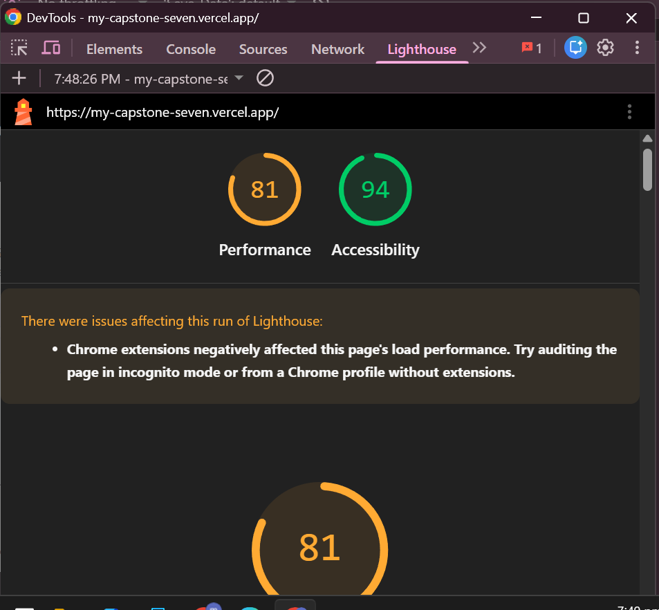
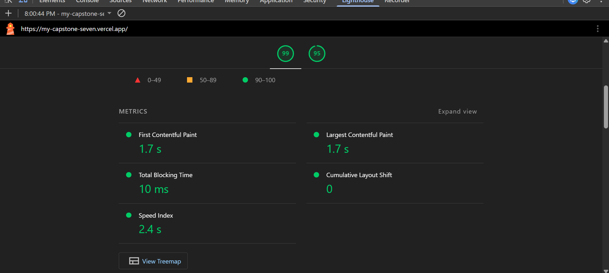
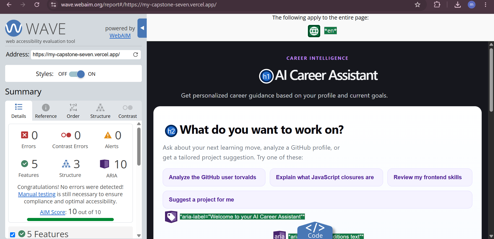

# FE-10 Accessibility and Performance Audit

## Scope

The existing deployed `my-capstone` preview was audited using **Lighthouse Mobile**, **WAVE**, and **keyboard-only testing**, with special attention to the AI chat flow (streamed assistant output, the Stop control, and live-region announcements). The audit ran against the deployed preview without changing application behavior; only the fixes listed below were applied, and no new feature work was introduced.

## Baseline — Before Fixes

Initial valid Lighthouse Mobile run (before fixes). This run reported a contrast issue and a missing main landmark.

| Metric              | Value |
| ------------------- | ----- |
| Performance         | 81    |
| Accessibility       | 94    |
| FCP                 | 1.7 s |
| LCP                 | 1.8 s |
| TBT                 | 660 ms |
| CLS                 | 0     |
| Speed Index         | 3.7 s |

**Lighthouse BEFORE screenshot:**

## WAVE Baseline / Findings

Initial WAVE evaluation found:

- **1 contrast error** (very low contrast).
- Affected text: _"Get personalized career guidance based on your profile and current goals."_ (`.ai-chat-summary`).
- Initial computed colors: foreground `#6B7280` on dark background `#16171D`.
- Initial WAVE **AIM score: 9.1 / 10**.

The contrast issue was fixed (see below) and re-verified with the final WAVE audit, which reported **0 errors** and an **AIM score of 10 / 10**.

## Accessibility and Performance Fixes

Only the following actual fixes were made:

1. **`.ai-chat-summary` contrast improvement** — changed to `color: #D1D5DB;` (in `src/components/AIChat/AIChat.css`). This resolved the WAVE contrast error and contributed to the WAVE AIM score reaching 10 / 10.
2. **Semantic `<main>` landmark** — added a `<main>` element in `src/App.jsx` wrapping the two existing sections (`#ai-career-assistant` and `#profile-settings`) to address Lighthouse's "Document does not have a main landmark" finding.
3. **Keyboard-only verification** — completed end-to-end keyboard-only testing of the primary flow (see checklist below).
4. **AI-specific accessibility verification** — verified that streamed output is announced politely via `aria-live="polite"` and that the Stop control is a keyboard-reachable, accessible button. No implementation changes were required; the behavior was already present and was documented.

No other fixes were made. The measured Lighthouse Performance improvement between recorded runs is reported separately from these code changes (see Measurable Delta).

## Keyboard-Only Verification

Primary flow tested using keyboard only (no mouse). All items passed:

| Tested item                                      | Result |
| ------------------------------------------------ | ------ |
| Chat input reachable by keyboard (Tab)           | PASS   |
| Text entry works                                 | PASS   |
| Send control reachable and usable by keyboard    | PASS   |
| Streaming chat flow works                         | PASS   |
| Stop button keyboard reachable while streaming    | PASS   |
| Stop action works from keyboard (Enter/Space)     | PASS   |
| Focus remained visible throughout                 | PASS   |
| No focus trap encountered                         | PASS   |
| Primary flow completable without a mouse          | PASS   |

## AI-Specific Accessibility

- **Streamed output announcement** — the chat message area (`.chat-area`) is wrapped in a container with `aria-live="polite"` and `aria-relevant="additions text"` (`src/components/AIChat/AIChat.jsx`), so streamed assistant text is announced politely as it arrives without interrupting the user.
- **Keyboard-reachable Stop button** — while streaming, a native `<button type="button" className="chat-stop-button" aria-label="Stop generation">` is rendered, which is keyboard focusable and operable.
- **Keyboard activation** — the Stop button responds to Enter/Space like any native button.
- **Focus behavior** — focus stays visible during streaming and the Stop control appears in the normal tab order; no focus trap occurs. A `role="status"` note ("Generation stopped.") is also shown when stopped.

## Final Audit Results

| Metric                              | Value |
| ----------------------------------- | ----- |
| Lighthouse Performance (Mobile)     | 99 / 100 |
| Lighthouse Accessibility (Mobile)   | 95 / 100 |
| WAVE Errors                         | 0     |
| WAVE Contrast Errors                | 0     |
| WAVE Alerts                         | 0     |
| WAVE AIM Score                      | 10 / 10 |

**Lighthouse AFTER screenshot:**

**WAVE FINAL screenshot:**

## Measurable Delta

| Measure                | Before → After      | Delta |
| ---------------------- | ------------------- | ----- |
| Performance (Lighthouse) | 81 → 99            | +18 points between recorded runs |
| Accessibility (Lighthouse) | 94 → 95          | +1 point between recorded runs |
| WAVE AIM               | 9.1 → 10.0          | +0.9 |
| WAVE Errors            | 1 → 0               | −1 |
| WAVE Contrast Errors   | 1 → 0               | −1 |

> **Note:** Lighthouse scores are variable between runs. The score deltas above are the differences between the recorded before/after runs and should **not** be interpreted as every point of the performance change being caused by the code changes. The two actual code changes (the `.ai-chat-summary` contrast fix and the `<main>` landmark) directly address the specific WAVE contrast error and the Lighthouse main-landmark finding; the remainder of the measured performance delta reflects run-to-run Lighthouse variance.

## Remaining Observations

Final Lighthouse diagnostics showed only minor remaining opportunities:

- Approximately **25 KiB unused JavaScript**.
- **3 long main-thread tasks**.

These did not prevent meeting the FE-10 target (Lighthouse Mobile Performance 99 and Accessibility 95, both 90+) and were intentionally not changed, because the assignment does not call for new feature work or unnecessary optimization that could alter application behavior.

## Conclusion

The audited deployed preview meets the FE-10 target:

- **Lighthouse Mobile Performance: 99**
- **Lighthouse Mobile Accessibility: 95**
- **WAVE: 0 errors / 0 contrast errors / 0 alerts** (AIM 10 / 10)
- **Keyboard-only primary flow passed**

AI-specific accessibility (polite live-region announcements for streamed output and a keyboard-reachable Stop button) is implemented and verified.
